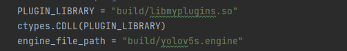
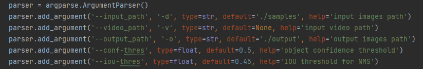
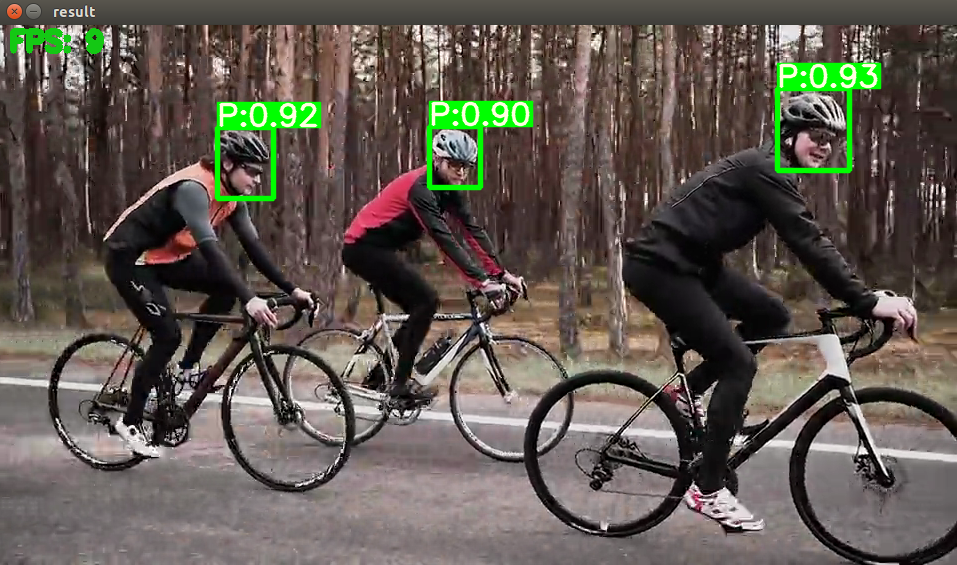
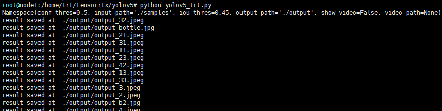

# yolov5-TRT C++&Python

项目地址 [wang-xinyu/tensorrtx](https://github.com/wang-xinyu/tensorrtx).   
## 说明
TensorRT加速的yolov5s，用于头盔检测，可在jetson nano上运行，FPS10左右。     
同时这份代码不仅限于头盔检测，对于其他版本的yolov5s以及预测任务，都可以按照tensorrtx的readme进行相应修改后使用。     
在tensorrtx原项目的基础上，我修改了yolov5_trt.py的代码，使用numpy做网络的后处理，移除了源代码对pytorch的依赖，使得代码能在jetson nano上运行。

## 环境
以下步骤都在NGC镜像:nvcr.io/nvidia/pytorch:21.06-py3和jetson nano 的jetpack 4.4系统上成功运行。

yolov5目前有v1.0, v2.0, v3.0, v3.1, v4.0 和v5.0几个版本，网络结构稍有差别，如果想转化自己的yolov5模型，首先要确定自己模型版本，然后在release中下载对应版本的tensorrtx。我们的头盔检测使用的是yolov5s-3.1，所以下载对应版本的tensorrtx release，并按照其[README.MD](https://github.com/wang-xinyu/tensorrtx/tree/yolov5-v3.1/yolov5)操作。

## C++

**大致步骤：**

+ 通过gen_wts.py将yolov5s.pt转为yolov5s.wts
+ build，然后sudo ./yolov5 -s生成yolov5s.engine
+ sudo ./yolov5 -d  ../samples 调用yolov5s.engine文件，检测samples文件夹中的图片。

**详细步骤：**
1. git clone -b yolov5-v3.1 https://github.com/wang-xinyu/tensorrtx.git 下载tensorrtx 3.1。
2. 按照提示修改number of classes(仓库里的已经改过)

 
3. git clone -b v3.1 https://github.com/ultralytics/yolov5.git 下载yolov5 3.1的官方仓库。       
4. 拷贝 tensorrtx/yolov5/gen_wts.py 到 ultralytics/yolov5。     
5. 将待转化模型拷贝到ultralytics/yolov5，确保.pt文件名为yolov5s.pt。     
6. 在ultralytics/yolov5文件夹下执行 python gen_wts.py，生成yolov5s.wts文件。     
7. 将yolov5s.wts 放到tensorrtx/yolov5文件夹       
8. + mkdir build
    + cd build
    + cmake ..
    + make      
9. sudo ./yolov5 -s 生成yolov5s.engine文件      
10. sudo ./yolov5 -d  ../samples 调用yolov5s.engine文件，检测samples文件夹中的图片。输出在output文件夹。

## Python

**说明**

在C++那些步骤的基础上，可以直接运行python yolov5_trt.py，会自动去加载build文件夹下的yolov5s.engine和libmyplugins.so。默认检测samples文件夹下的图片，结果保存在output文件夹。



如果使用的是刚拉取下来的nvcr.io/nvidia/pytorch:21.06-py3镜像，需要安装以下环境：

+ pip install opencv-python -i http://mirrors.aliyun.com/pypi/simple/ --trusted-host mirrors.aliyun.com
+ apt update
+ apt install libgl1-mesa-glx

这个代码和原仓库代码的区别就是使用numpy替代torch做了模型输出的后处理，让它能在jetson nano上运行。

**参数说明：**



-d：输入图片文件夹

-o：保存输出的文件夹

-v：如果想检测视频，就加-v，如：python yolov5_trt.py -v 1.mp4，会覆盖检测图片的操作。

-s：是否显示视频检测结果，在服务器上运行的时候不能加，不然会因为显示不了，报错。

**运行**
```
python yolov5_trt.py -v 1.mp4 -s  
```
"P" represents have helmet, "N" represents no helmet.

  
  
  按esc中止。
  
+ python yolov5_trt.py

  

