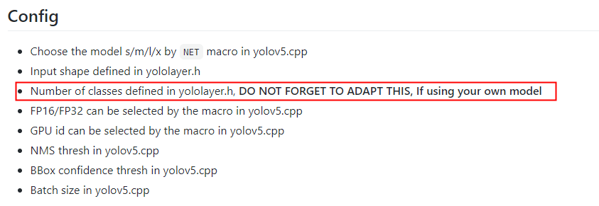
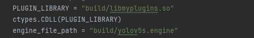
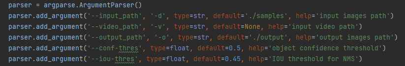
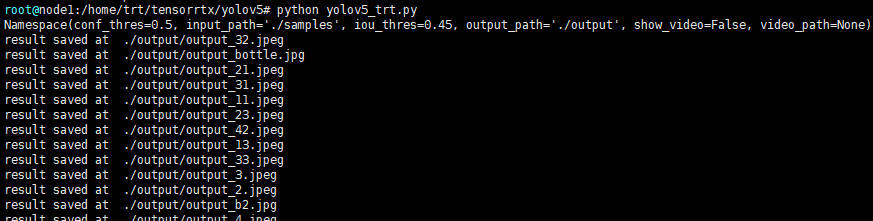

# yolov5-TRT C++&Python
[中文版](README-zh.md) | English version  
Based on: [wang-xinyu/tensorrtx](https://github.com/wang-xinyu/tensorrtx).     
## State
TensorRT accelerated Yolov5s, used for helmet detection, can run on jetson Nano, FPS=10.    
On the basis of the tensorrtx, I modified yolov5_trt.py, using Numpy for network post-processing, 
removed the source code's dependence on PyTorch, which made the code run on jetson nano.        
At the same time, this code is not limited to helmet detection, for other versions of Yolov5s and 
prediction tasks, you just need to make corresponding modification according to the TensorRTX readme.
## Environment
Following steps worked successfully on these environments:  
+ NGC docker image:nvcr.io/nvidia/pytorch:21.06-py3   
+ jetpack 4.4 on jetson nano

yolov5s has v1.0, v2.0, v3.0, v3.1, v4.0 and v5.0, there are some differences between the network structure, if you want to
convert your yolov5s model, make sure using the right version of tensorrtx.
First determine version of your own model, then download corresponding tensorrtx in the release.
I use yolov5s-3.1 for helmet detection, so I follow this [README.MD](https://github.com/wang-xinyu/tensorrtx/tree/yolov5-v3.1/yolov5)

## C++

**General steps:**

+ convert yolov5s.pt to yolov5s.wts using gen_wts.py 
+ build,then sudo ./yolov5 -s to generate yolov5s.engine
+ sudo ./yolov5 -d  ../samples, call yolov5s.engine, detect images in samples folder.

**Detailed steps：**
1. git clone -b yolov5-v3.1 https://github.com/wang-xinyu/tensorrtx.git to download tensorrtx 3.1
2. modify the number of classes in yololayer.h

       
3. git clone -b v3.1 https://github.com/ultralytics/yolov5.git to download yolov5:3.1 official repository       
4. copy tensorrtx/yolov5/gen_wts.py to ultralytics/yolov5       
5. copy your model to ultralytics/yolov5, make sure the file name is yolov5s.pt     
6. run python gen_wts.py in ultralytics/yolov5, a file named yolov5s.wts will be generated      
7. put yolov5s.wts into tensorrtx/yolov5        
8. make and build
  ```
mkdir build
cd build
cmake ..
make
```
10. sudo ./yolov5 -s , serialize model to plan file i.e. 'yolov5s.engine'  
11. sudo ./yolov5 -d ../samples, deserialize plan file and run inference, the images in samples will be processed,
 results are saved in output folder.


## Python

**State**

Based on those C++ steps, you can run ``python yolov5_trt.py`` directly. It will call yolov5s.engine and libmyplugins.so
in build/ folder, detects images in samples/ by default.     


If you use a new nvcr.io/nvidia/pytorch:21.06-py3 image, set up following steps：
```
python3 -m pip install opencv-python
apt update
apt install libgl1-mesa-glx
```

**Parameters：**


```
-d：path to input folder

-o：path to output folder

-v：for video detection, add -v, for example：``python yolov5_trt.py -v 1.mp4``, which overrides commands
of images.

-s：show the result.
```
**RUN**
```
python yolov5_trt.py -v 1.mp4 -s  
```
"P" represents have helmet, "N" represents no helmet.

  
  
  Press esc to stop
```
python yolov5_trt.py
```
  

